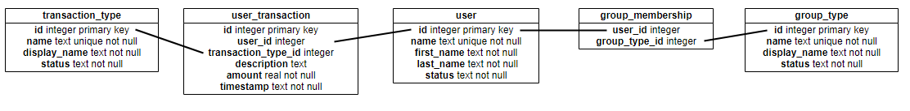

In the repo is a SQLite database file.  We chose SQLite simply because it’s easy to move around/send to you.  This exercise could just as well be done with PostgreSQL, MySQL, or any other relational database.  The following are the tables defined and their relation to one another (this is not a true ERD, but gives you a feel for the overall data model).

# Requirements

What we want is a command line tool that helps us glean some basic information from the data in the database.  This can be written in whatever language you prefer.  At a minimum we should be able to ask it, and it should be able to tell us:

•	An outline of user’s account balances.  This should list each user, each month, and what their account balance is for that month.

•	The year-to-date balance of each group.  That is, what is the account balance across all months for all users in a group?

•	How many transactions of each transaction type have happened per month?  For example there has been “20 food transactions in January”.

# Some other facts about the database

•	A group can have many users and a user can be in multiple groups.

•	A user can have 0 or more entries in the user_transaction table.

•	The user, transaction_type, and group_type tables all have a “status” column .  This is either A (active) or I (inactive).  All analysis should be performed against only active entries.

•	The user, transaction_type, and group_type tables also have both “name” and “display_name” columns.  The name column is for internal use whereas the display_name column should be used when presenting to the user.

# Optional Requirements
Implement an API that provides the same functionality as the command line tool listed above. 

# Additional Notes
If there are any other useful features you think would be good to include, go ahead!
If you have any questions please reach out to us.
